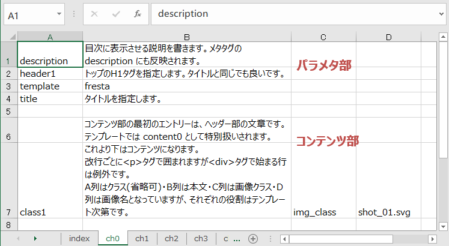

# Fresta テキストコンバータ
このコンバータは、一定の制約の下、エクセルファイルを元にHTMLのテキストツリーを生成するPerlスクリプトです。

以下のディレクトリを用意します
- clone_dir : このスクリプトツリーを展開するディレクトリ
- master_dir : マスター(入力)となるエクセルやテンプレート、画像などを置くディレクトリ
- output_dir : 生成されたドキュメントツリーを公開するディレクトリ

また、ソースツリーを用意します。git で管理することを前提にしています。
- git@github.com:user/master_git.git : master_dir に含まれるエクセルファイルや画像ファイルなど

1. コアプログラムを clone
   ~~~
   cd /clone_dir/
   git clone git@github.com:tsuchim/fresta-text-conv.git
   ~~~
   または
   ~~~
   git clone https://github.com/tsuchim/fresta-text-conv.git
   ~~~

1. サブモジュールをアップデートしコンパイル
   ~~~
   git submodule update -i
   cd libs/Spreadsheet-XLSX/
   make
   cd -
   ~~~
   > libs/Spreadsheet-XLSX/lib/Spreadsheet/XLSX.pm
   が作られたことを確認してください。

1. 入力リポジトリの展開

   /master_dir の親ディレクトリを /master_parent_dir とすると
   ~~~
   cd /master_patent_dir/
   git clone git@github.com:user/master_git.git
   sudo chcon -R -t httpd_sys_content_t master_dir
   ~~~
   オーナーやパーミッション・コンテクストは環境に合わせて設定してください。

1. 出力ディレクトリの準備
   ~~~
   mkdir /output_dir/
   chmod 777 /output_dir/
   ~~~
   パーミッションなどは環境によります。わからない場合は管理者に聞いて下さい。
   
1. 出力用CGIの準備

   変換をWeb上で行いたい場合には、出力ディレクトリにリンクを貼り、実行権限を設定します。
   1. .htaccess に、SetEnv で MASTER_DIR を定義します。
   1. もし .htaccess が外から見えてしまう状態なら、アクセスを制限します。
   1. このままでは誰でも変換を実行出来てしまうので(それでも実害は少ないですが)
      .htaccess にアクセス可能なIPアドレスを設定するか、認証の設定をします。
      この例では、アクセスを 192.168.11.22 からに制限します。
      
      ### .htaccess
      ~~~
      SetEnv MASTER_DIR /master_dir
      
      <FilesMatch \.cgi$>
        Sethandler cgi-script
      
        order deny,allow
        deny from all
        allow from 192.168.11.22/32
      </FilesMatch>
      <FilesMatch ^\.>
        order deny,allow
        deny from all
      </FilesMatch>
      ~~~

   1. リンクを貼り、必要に応じてパーミッションやコンテクストを指定します。
      ~~~
      cd /output_dir/
      ln -s /clone_dir/xlsx2html.pl convert.cgi
      chmod 755 /clone_dir/xlsx2html.pl
      sudo chcon -t httpd_sys_script_exec_t convert.cgi
      ~~~

   1. この状態で、convert.cgi にアクセスすると、ファイルの一覧が表示されます。
      「Convert」をクリックすると、変換が行われます。

# Excel format
- 入力エクセルファイルは、マスターディレクトリに配置します。
  図表など、本文に付随する外部ファイルは、
  エクセルファイルのbasenameと同じ名前のディレクトリを作り
  その中に配置します。
  HTMLの生成には、テンプレートファイルが使われます。

- テンプレートエンジンは[HTML::Templete](https://metacpan.org/pod/HTML::Template)を使用しています。
  スタイルシートなど、テンプレートに付随する外部ファイルは、
  テンプレートファイルのbasenameと同じ名前のディレクトリを作り
  その中に配置します。

  使用するテンプレートファイル名はエクセルファイルの中で指定しますが、
  省略すると、同じ basename に .tmpl をつけたファイルがテンプレートとして採用されます。

- 
- エクセルファイルは、1つのドキュメントツリーにつき1つのファイルを用意します。

- 複数のページを出力する場合は、対応した数のシートを準備します。
  最初に見出しのシート「index」を用意し、
  次に、コンテンツのシート「ch1」を用意します。
  コンテンツが複数ページある場合は「ch2」「ch3」と順に作ります。
  連番を「0」からにしたい場合は「ch0」から始めて下さい。
  最初のシート以外のシート名の番号は順番になっていなくても、連番として振り直されます。

- 各シートは、空白行を挟んで、前半のパラメタ部と、後半のコンテンツ部に分かれます。

- パラメタ部には、A列にパラメタ名、B列にパラメタ値が入ります。
  - title : ページタイトル。
  - header1 : H1 タグ。多くの場合 title と同じでしょう。
  - description : ページの説明。目次に使われる他、メタタグにも使われます。
  - templete : 出力に使用するテンプレートファイル名。
    省略すると、エクセルファイルと同じベース名となります。

- コンテンツ部には、コンテンツを羅列します。
  - コンテンツ部の最初の行は、ヘッダーコンテント(content0)として扱われます。
    出力はテンプレートに依存します。
    
  - 2行目以降は、A列から順に col0, col1 という名前が振られ、
    ループとして展開されます。
    それぞれの役割はテンプレートに依存します。

    デフォルトの書式は
      - A列(col0) : クラス名(省略時はテンプレート内で指定)
      - B列(col1) : 本文
      - C列(col2) : 画像クラス名(画像がある場合)
      - D列(col3) : 画像ファイル名(同上)
    となります。

    本文(B列)は、改良された角行が p タグで括られます。
    任意のタグで括りたい場合は、タグを明記して下さい。

    strong 等のタグはそのまま認識されます。

